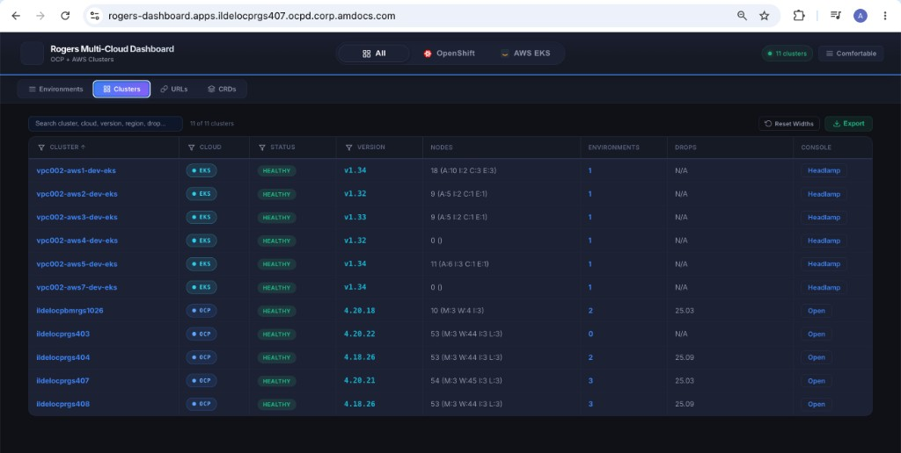
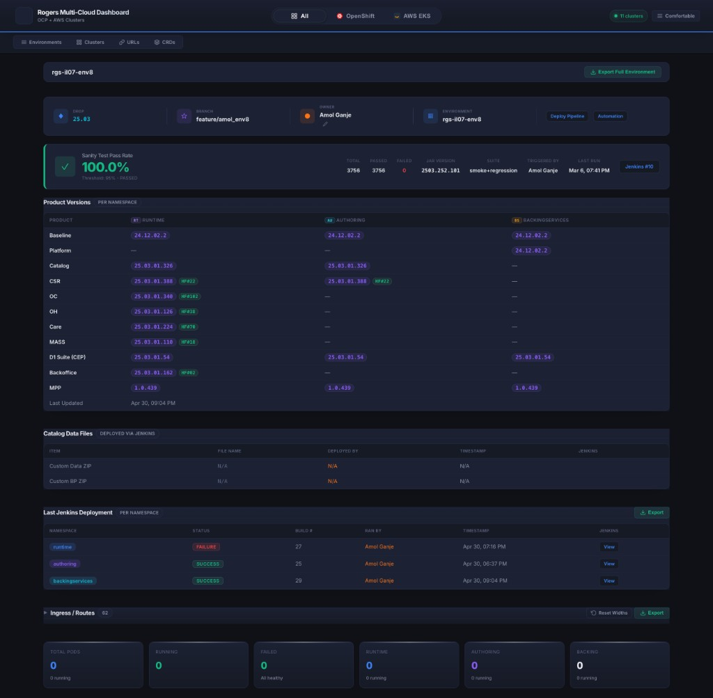
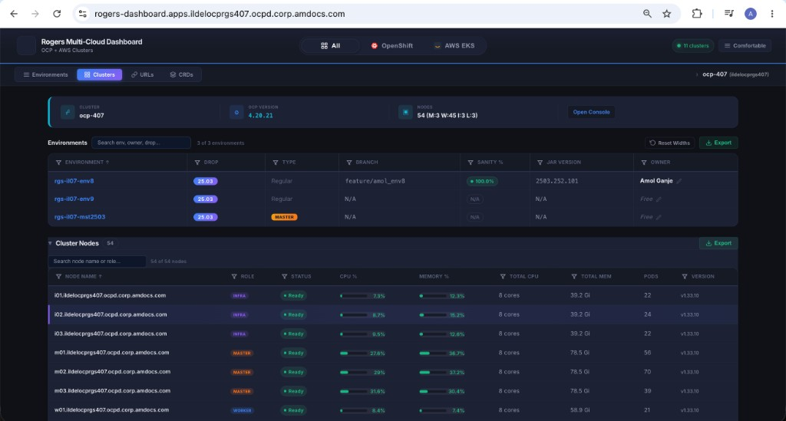
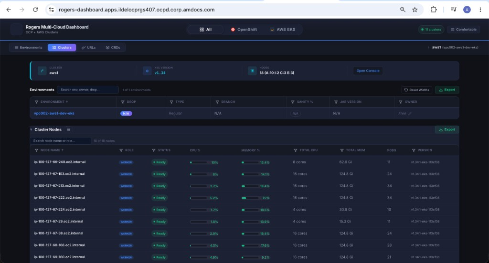
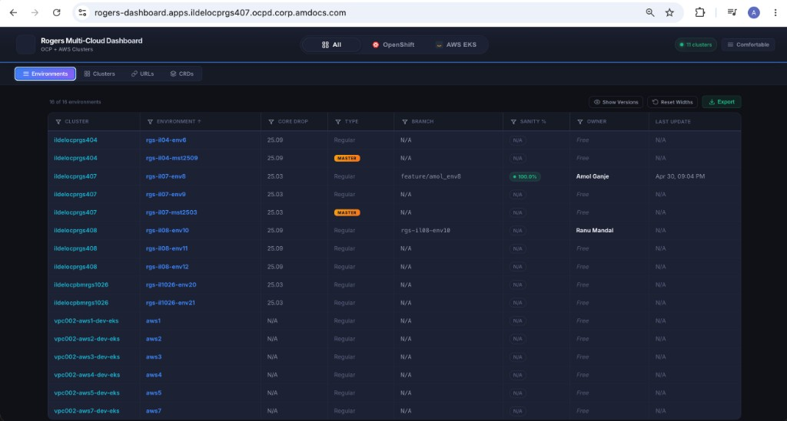
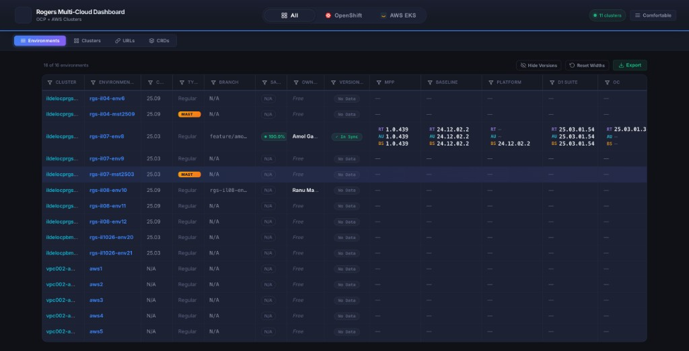
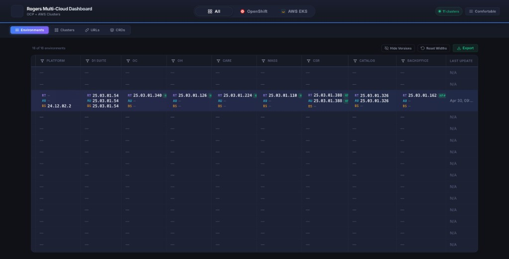
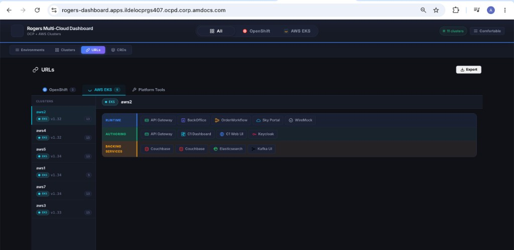
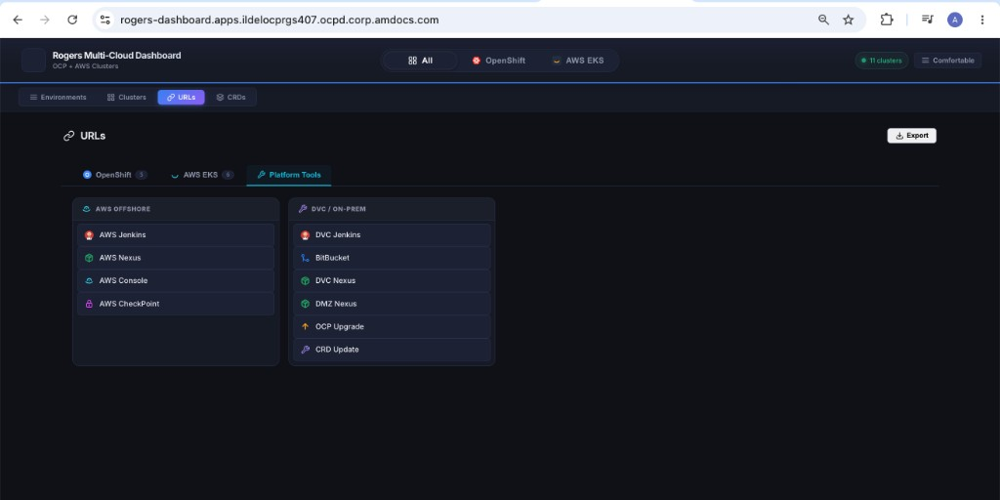
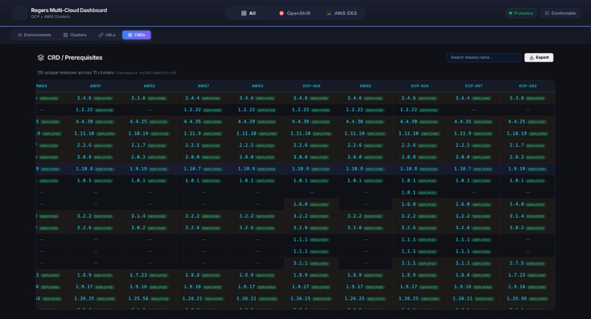

# Multi-Cloud Kubernetes Dashboard

> A unified operations dashboard that brings **OpenShift** and **AWS EKS** clusters into a single pane of glass — built to manage 11+ production clusters and 50+ environments at an enterprise telecom.

<p align="center">
  
</p>

## The Problem

Managing Kubernetes infrastructure across **multiple cloud providers** is painful:
- OCP and EKS have different consoles, APIs, and authentication mechanisms
- Teams waste time switching between consoles to check cluster health, environment status, and product versions
- No single view exists to compare CRD versions, Helm releases, or product deployments across clusters

**This dashboard solves that** by aggregating real-time data from all clusters into one searchable, sortable, exportable interface.

---

## What It Does

| Capability | Details |
|-----------|---------|
| **Multi-Cloud Fleet View** | Unified cluster list with health, version, node breakdown (M/W/A/I/C/E roles), and environment count |
| **Environment Tracking** | Drop versions, branches, owners, sanity test pass rates, and product version matrix across RT/AU/BS namespaces |
| **EKS Auto-Discovery** | No manual cluster registration — discovers EKS clusters via AWS API and classifies node groups automatically |
| **Product Version Matrix** | Per-namespace version comparison with HF (hotfix) badge tracking and cross-namespace mismatch detection |
| **Service URL Catalog** | Organized by cluster and namespace role (Runtime, Authoring, Backing Services) with quick-link panels |
| **CRD Comparison Matrix** | Cross-cluster Helm release version comparison with drift detection |
| **Export Everything** | CSV export on every table |

---

## Screenshots

### Cluster Fleet Overview
<p align="center">
  
</p>

### Environment Detail — Product Versions, Sanity Tests, Jenkins Deployments
<p align="center">
  
</p>

### Cluster Deep-Dive — OCP (Nodes, CPU/Memory, Environments)
<p align="center">
  
</p>

### Cluster Deep-Dive — AWS EKS (Application, Infra, Couchbase, Elasticsearch nodes)
<p align="center">
  
</p>

<details>
<summary><b>More Screenshots</b> (click to expand)</summary>

### Environments Table with Inline Product Versions
<p align="center">
  
</p>

### Product Versions — Expanded View
<p align="center">
  
</p>

### Product Versions — Scrolled (OC, OH, Care, MASS, CSR, Catalog, Backoffice)
<p align="center">
  
</p>

### Service URL Catalog — EKS
<p align="center">
  
</p>

### Platform Tools Quick Links
<p align="center">
  
</p>

### CRD / Prerequisites Comparison Matrix
<p align="center">
  
</p>

</details>

---

## Architecture

```
┌─────────────────────────────────────────────────────────────────┐
│                        Browser (SPA)                            │
│   Vanilla JS  ·  CSS Variables  ·  Dark Theme  ·  localStorage  │
└──────────────────────────┬──────────────────────────────────────┘
                           │  REST API (JSON)
┌──────────────────────────▼──────────────────────────────────────┐
│                    Flask Backend (app.py)                        │
│   /api/clusters · /api/environments · /api/env/<dc>/<env>       │
│   /api/services · /api/quick-links  · /api/crd-releases         │
└───────┬─────────────────────────────────────────┬───────────────┘
        │                                         │
┌───────▼───────────┐                   ┌─────────▼───────────┐
│   k8s_client.py   │                   │   aws_client.py     │
│ • OCP OAuth login  │                   │ • STS token gen     │
│ • K8s API calls    │                   │ • boto3 EKS client  │
│ • ThreadPoolExec   │                   │ • Auto-discovery    │
│ • In-memory cache  │                   │ • Node group class  │
└───────┬───────────┘                   └─────────┬───────────┘
        │                                         │
   OCP Clusters (:6443)                    EKS Clusters (:443)
```

---

## Tech Stack

| Layer | Technology |
|-------|-----------|
| **Frontend** | Vanilla JavaScript (ES6+), CSS3 Custom Properties, HTML5 |
| **Backend** | Python 3.9+, Flask, Gunicorn |
| **Kubernetes** | `kubernetes-client/python`, OpenShift OAuth, AWS STS |
| **AWS** | `boto3`, `botocore` (EKS describe-cluster, list-clusters, STS) |
| **Deployment** | Docker multi-stage build, OpenShift Route, systemd (bare metal) |
| **CI/CD** | Jenkins Pipelines (CI + CD), Helm 3 charts, Makefile |
| **Caching** | In-memory with configurable TTL, SQLite for history (optional) |

---

## CI/CD Pipeline

Fully automated build, test, and deployment pipeline using Jenkins with Kubernetes pod agents.

```
┌──────────────────────────────────────────────────────────────────────────┐
│                          CI Pipeline (Jenkinsfile)                        │
│                                                                          │
│   ┌─────────┐    ┌─────────┐    ┌─────────────┐    ┌──────────────┐     │
│   │  Lint    │───▶│  Test   │───▶│ Build Image │───▶│ Push to Nexus│     │
│   │ flake8  │    │  smoke  │    │  multi-stage│    │  Docker Reg  │     │
│   │ pylint  │    │  pytest │    │  + labels   │    │  :tag + :latest    │
│   └─────────┘    └─────────┘    └─────────────┘    └──────┬───────┘     │
│                                                           │              │
└───────────────────────────────────────────────────────────┼──────────────┘
                                                            │ trigger
┌───────────────────────────────────────────────────────────▼──────────────┐
│                          CD Pipeline (Jenkinsfile.cd)                     │
│                                                                          │
│   ┌───────────┐    ┌──────────────┐    ┌──────────┐    ┌──────────┐     │
│   │ Pre-flight│───▶│ Deploy to    │───▶│ Rollout  │───▶│  Verify  │     │
│   │ validate  │    │ OCP cluster  │    │  wait    │    │ healthz  │     │
│   │ dry-run   │    │ (oc apply)   │    │ status   │    │ HTTP 200 │     │
│   └───────────┘    └──────────────┘    └──────────┘    └──────────┘     │
│                                                                          │
│   Supports: single cluster │ multi-cluster │ dry-run │ staging/prod      │
└──────────────────────────────────────────────────────────────────────────┘
```

### CI Pipeline (`Jenkinsfile`)

| Stage | What it does |
|-------|-------------|
| **Lint** | `flake8` + `pylint` static analysis |
| **Test** | Smoke test (mock mode health check + API validation) + `pytest` if tests exist |
| **Build** | Multi-stage Docker build with git commit/branch/build labels baked in |
| **Push** | Tags and pushes to Nexus Docker registry (`:build-sha` + `:latest`) |
| **Trigger CD** | Auto-triggers CD pipeline on `main` branch merges |

### CD Pipeline (`Jenkinsfile.cd`)

| Stage | What it does |
|-------|-------------|
| **Pre-flight** | Validates image tag, target cluster, environment |
| **Deploy** | `oc login` → `oc apply` ConfigMap + Deployment → `oc set image` |
| **Rollout** | Waits for `oc rollout status` with 120s timeout |
| **Verify** | Hits `/healthz` on the Route and verifies HTTP 200 |

Supports **multi-cluster deployment** (deploy to one cluster or all), **dry-run** mode, and **staging/production** environment selection.

### Helm Chart

Templated Kubernetes manifests for consistent multi-environment deployments:

```bash
# Preview rendered manifests
make helm-template

# Deploy to a specific cluster
helm upgrade --install rogers-dashboard helm/rogers-dashboard \
    --namespace rogers-dashboard --create-namespace \
    --set image.tag=42-abc1234

# Deploy with persistent history DB
helm upgrade --install rogers-dashboard helm/rogers-dashboard \
    --set persistence.enabled=true \
    --set persistence.size=2Gi
```

---

## Key Technical Highlights

- **Multi-threaded cluster polling** — `ThreadPoolExecutor` queries all 11+ clusters in parallel for sub-second page loads
- **EKS auto-discovery** — `list_clusters()` + `describe_cluster()` eliminates manual EKS registration; node groups are classified by `eks.amazonaws.com/nodegroup` labels into Application, Infra, Couchbase, Elasticsearch roles
- **Dual authentication** — OCP OAuth (user/password → token) and AWS STS (access key → presigned token) handled transparently
- **Version intelligence** — Parses product version ConfigMaps per namespace, detects RT/AU/BS mismatches, tracks HF (hotfix) numbers
- **Zero-framework frontend** — No React/Vue build step; single `dashboard.js` file (~3K lines) with localStorage state persistence, column resizing, density toggle, and CSV export
- **CI/CD automation** — Jenkins pipelines with Kubernetes pod agents, Nexus registry integration, Helm charts for templated deploys, multi-cluster rollout with health verification
- **Mock mode** — Full demo with realistic data for development without cluster access
- **Proxy-aware** — Configurable HTTP/HTTPS/NO_PROXY for corporate network environments

---

## Quick Start

### Demo Mode (No Cluster Access Needed)

```bash
git clone https://github.com/amolganje/multi-cloud-k8s-dashboard.git
cd multi-cloud-k8s-dashboard

python3 -m venv .venv && source .venv/bin/activate
pip install -r requirements.txt

export MOCK_MODE=true
python app.py
```

Open [http://localhost:8080](http://localhost:8080)

### Production Deployment (OpenShift)

```bash
docker build -t <your-registry>/rogers-dashboard:latest .
docker push <your-registry>/rogers-dashboard:latest

oc new-project rogers-dashboard
oc create secret generic rogers-dashboard-cred \
  --from-literal=OCP_USERNAME=<svc-account> \
  --from-literal=OCP_PASSWORD=<password> \
  --from-literal=AWS_ACCESS_KEY_ID=<key> \
  --from-literal=AWS_SECRET_ACCESS_KEY=<secret>

oc apply -f k8s/dashboard-config.yaml
oc apply -f k8s/deployment.yaml
```

### Deploy via Helm

```bash
helm upgrade --install rogers-dashboard helm/rogers-dashboard \
    --namespace rogers-dashboard --create-namespace \
    --set image.repository=<your-registry>/rogers-dashboard \
    --set image.tag=latest
```

### Makefile Shortcuts

```bash
make mock          # Run locally in demo mode
make build         # Build Docker image
make push          # Push to Nexus registry
make deploy        # Deploy to OpenShift (oc apply)
make helm-install  # Deploy via Helm
make test          # Run smoke tests
make lint          # Run linters
```

See [DEPLOY.md](DEPLOY.md) for bare-metal RHEL deployment with systemd.

---

## Project Structure

```
├── app.py                 # Flask routes & API endpoints
├── k8s_client.py          # Multi-cloud K8s client (OCP + EKS)
├── aws_client.py          # AWS STS token generation
├── config.py              # Environment configuration
├── mock_data.py           # Realistic mock data for demo mode
├── Dockerfile             # Multi-stage Docker build
├── Jenkinsfile            # CI pipeline (lint → test → build → push)
├── Jenkinsfile.cd         # CD pipeline (deploy → verify)
├── Makefile               # Dev workflow commands
├── static/
│   ├── js/dashboard.js    # Frontend SPA
│   └── css/dashboard.css  # Dark theme
├── templates/
│   └── dashboard.html     # Jinja2 template
├── helm/rogers-dashboard/ # Helm chart
│   ├── Chart.yaml
│   ├── values.yaml
│   └── templates/         # Deployment, Service, Route, PVC
├── k8s/
│   ├── deployment.yaml    # Raw K8s manifests
│   └── dashboard-config.yaml
└── deploy/
    └── rogers-dashboard.service  # systemd unit (bare metal)
```

---

## Configuration

| Variable | Description |
|----------|-------------|
| `MOCK_MODE` | `true` for demo with mock data |
| `CLUSTERS_CONFIG` | JSON map of OCP clusters |
| `AWS_REGION` | AWS region for EKS discovery |
| `AWS_ACCESS_KEY_ID` / `AWS_SECRET_ACCESS_KEY` | AWS credentials |
| `OCP_USERNAME` / `OCP_PASSWORD` | OpenShift service account |
| `HTTP_PROXY` / `HTTPS_PROXY` | Corporate proxy (optional) |

---

## License

MIT
